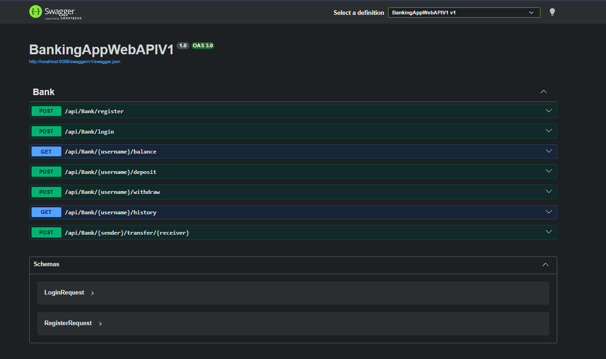
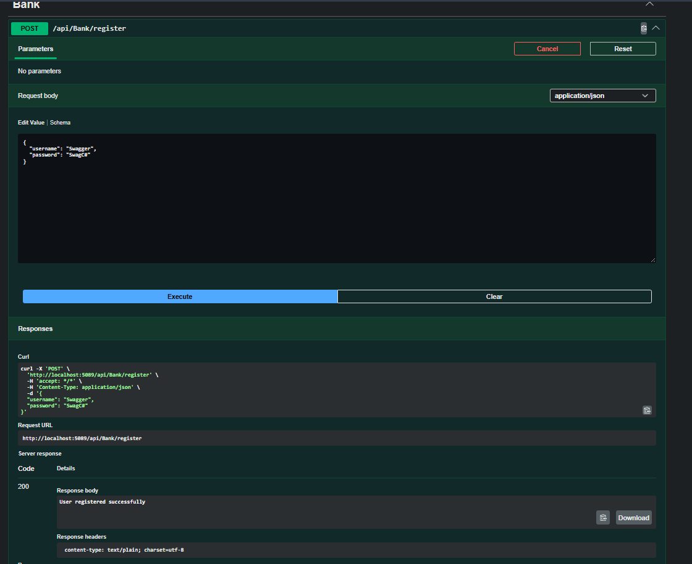
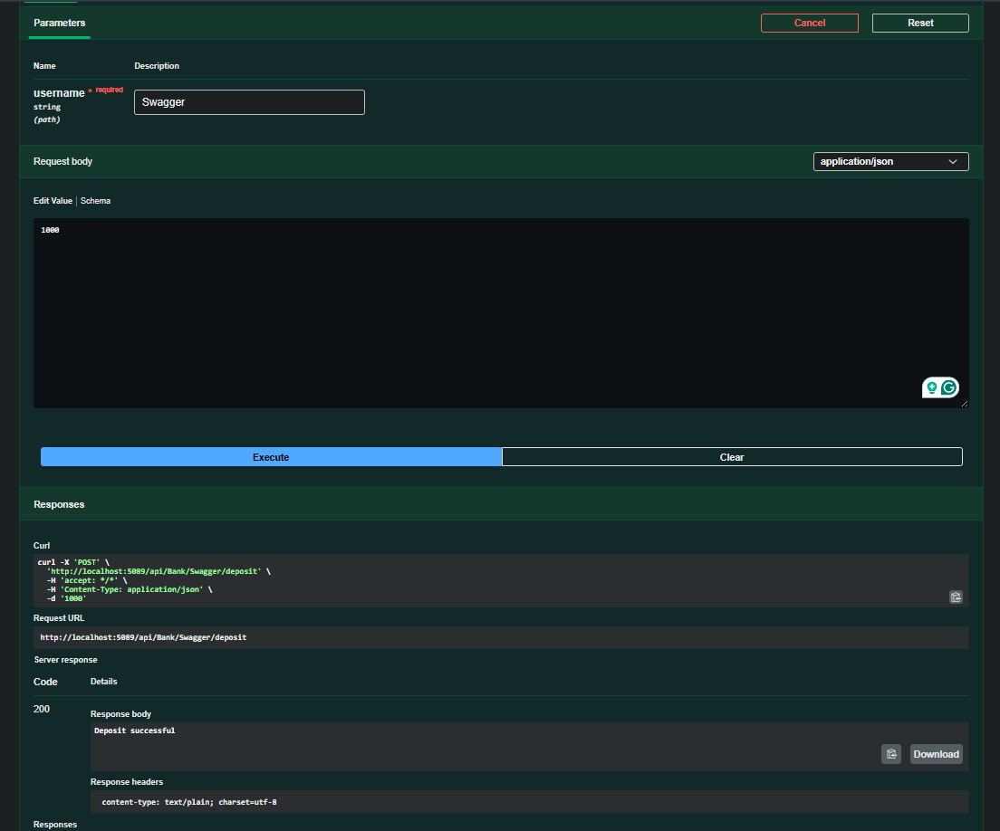
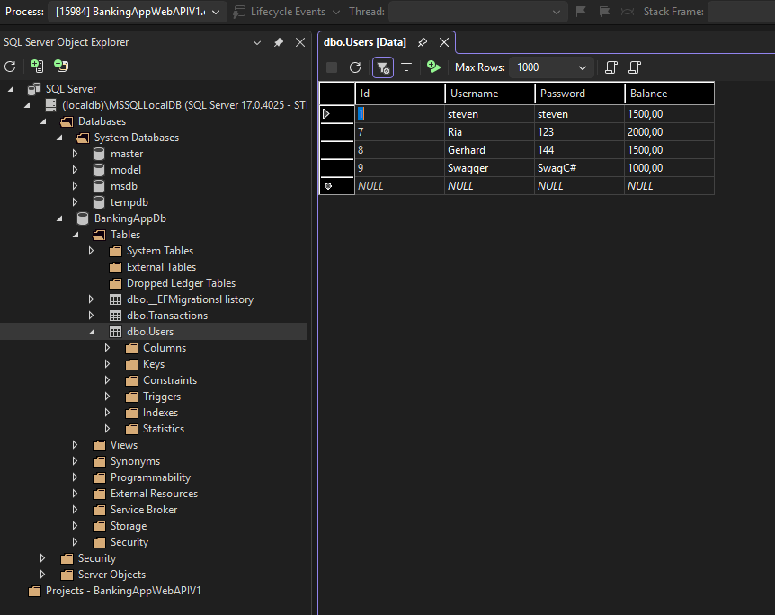

# 🏦 Banking API (ASP.NET Core Web API)

## 📖 Overview

A RESTful Banking API built with **ASP.NET Core Web API** that simulates core banking operations such as user registration, authentication, balance management, deposits, withdrawals, transfers, and transaction history.

The application follows a layered architecture using **Controllers**, **Services**, and **Repositories**, with **Entity Framework Core** handling data access and **SQL Server** providing persistent storage.

---

## ✨ Features

- User registration and authentication
- View account balance
- Deposit funds
- Withdraw funds
- Transfer funds between users
- View transaction history
- RESTful API endpoints
- Persistent data storage with SQL Server
- Entity Framework Core Code-First approach with migrations
- Interactive API testing using Swagger

---

## 🛠 Technologies

- C#
- ASP.NET Core Web API
- Entity Framework Core
- SQL Server (LocalDB)
- Swagger / Swashbuckle
- Visual Studio

---

## 🏗 Architecture

The project follows a layered architecture to separate responsibilities and improve maintainability.

```text
Client (Swagger)
        │
        ▼
   Controllers
        │
        ▼
    Services
        │
        ▼
  Repositories
        │
        ▼
Entity Framework Core
        │
        ▼
 SQL Server LocalDB
```

---

## 📷 Screenshots

### Home (Swagger)

<p align="center">
  
</p>

<p align="center"><em>Swagger UI providing interactive testing for every API endpoint.</em></p>

---

### Register User

<p align="center">
  
</p>

<p align="center"><em>Create a new bank account using the Register endpoint.</em></p>

---

### Deposit Funds

<p align="center">
  
</p>

<p align="center"><em>Deposit money into an existing account through the API.</em></p>

---

### SQL Server Database

<p align="center">
  
</p>

<p align="center"><em>Registered users are persisted in SQL Server LocalDB using Entity Framework Core.</em></p>
